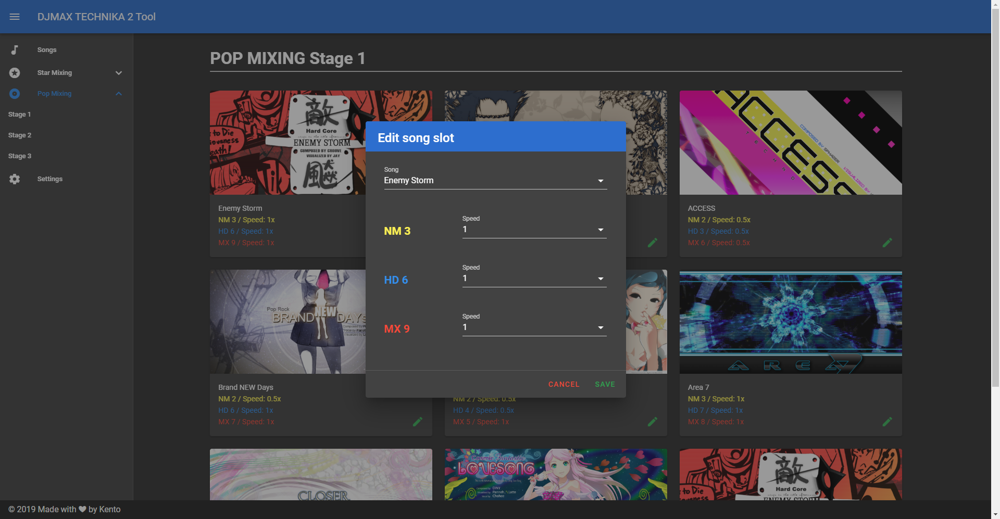

# DMT2-Tool
A tool to manage cracked DJMAX TECHNIKA 2

## Usage
1. Download exe from [release page](https://github.com/rogeraabbccdd/DMT2-Tool/releases/latest).
2. Install.
3. Delete your `discstock.csv` and `<star/pop>_stage_<num>.csv` in your `gamepath/Resource/DiscInfo/`.  
   **THIS IS IMPORTANT, I HAVE FORMATTED SONGS LIST FILE!**
4. Open Settings, set your game folder and save.
5. You can edit your song solots in stages.
6. If you got **opreation not permitted** error when edit song slots, make sure your `<star/pop>_stage_<num>.csv` is not readonly.

## Build
1. Download repository.
2. Run `yarn`.
3. Run `yarn elec-serve` to run.
4. Run `yarn elec-build` to build.

## Change log
### 1.0
- Release.
### 1.1
- Fix reset file path.
- Dark style scrollbar.
### 1.2
- Sort songs.
- Add and edit custom songs.
- Fix sidebar alignment.
- Fix sweet alert color.
- Remove extended song from song select option in edit slot form.
- Remove star mixing difficulty of extended songs.
- Validate path before every changes.
### 1.2.1
- Fix a bug that songs without star difficulty appear in songs list in slot edit.
- Fix wrong number when adding new custom song.
### 1.3.0
- All difficulties are open to edit in both mode now, including extra.
- Fix bugs.
### 1.3.1
- Fix bugs.
### 1.3.2
- Change app name to "DMT2 Tool"